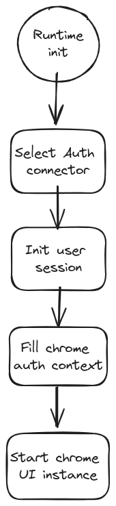

# Chrome auth

Description of how auth should be written and used within the chrome repo.

## Multi auth support

Chrome runs in environments with different auth connectors. To ensure compatibility, Auth connects are written and then mapped to a `ChromeAuthContext`. Aside from the auth wrappers, the rest of the source code must reference the `ChromeAuthContext` to get the auth values and methods.

Auth connector is picked on the UI startup based on which environment it is running in.

## Chrome auth context

Interface of `ChromeAuthContext` is described by the `ChromeAuthContextValue` type.

## Current auth connectors

### OIDC (OpenID Connect Protocol Suite)

Uses [oidc0client-ts](https://github.com/authts/oidc-client-ts) and [react-oidc-context](https://github.com/authts/react-oidc-context).

The OIDC connector is designed to connect to the RH keycloack auth services.

To learn more about how OIDC works readt the [docs](https://openid.net/).
